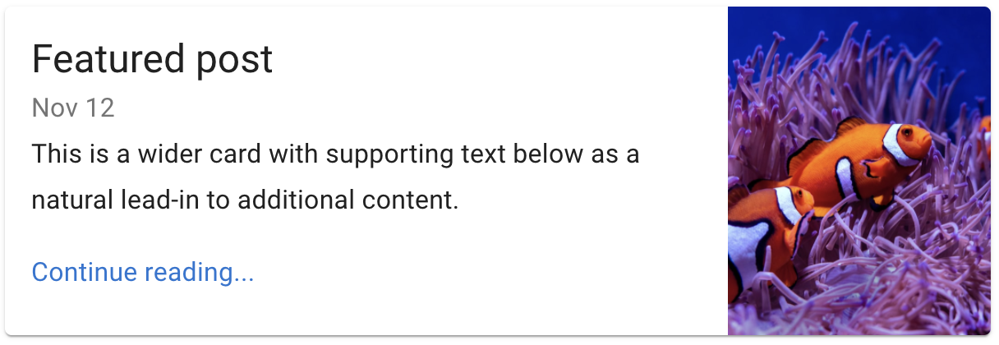

# Warm Up - Card Layouts

## Overview

Given that a card represents the visual display of structured content:

- Title
- Copy
- Media (images or video)
- Links

It's pretty boring to have all of your content looking the same. For that reason, designers like to alter the appearance of data on the website. Because the card pattern is dependable, given your markup rules, you should be able to apply different classes to the cards on your sites to apply any number of different looks.

Hero Card, where the image is the background, and the whole card is clickable

The same card content (and markup), but displayed in a shorter form, designed to be shows side by side with other cards.

## Challenge

1. Using CSS (or SASS), implement styling rules to lay out a card in other, more interesting ways, using only a class name applied to a card container
   - Image displayed to the right (or left)
   - Image displayed to the top (or bottom) of the content
   - Buttons at the top
   - Buttons hidden, but the card is clickable
   - Image is the background
   - ...other ideas?
