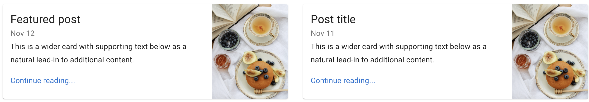
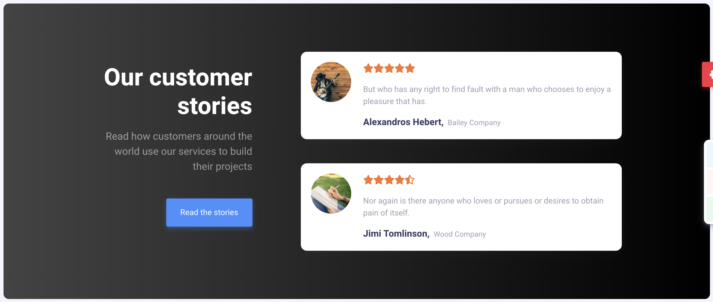

# Warm Up - Deck Layouts

## Overview

Given that a deck represents the visual display of a group of cards...

It's pretty boring to have all of your content looking the same. For that reason, designers like to alter the appearance of data on the website. Because the card and deck pattern is dependable, given your markup rules, you should be able to apply different classes to the decks on your sites to apply any number of different looks.

Product Highlights, where the middle card is a bit taller and bolder than the others

Here's a deck where the cards are also horizontal, but are configured more as callouts to get more information. This is a common pattern on blogging sites.

This deck has some very unique styling, where it's own background and title are a focal point and the cards themselves are smaller, but bolder.

## Challenge

1. Using CSS (or SASS), implement styling rules to lay out a deck in other, more interesting ways, using only a class name applied to the deck
   - Cards stacked or horizontal
   - Alternating backgrounds for the cards
   - Highlight a specific card
   - Hero deck with small cards
   - Carousel
   - Accordion
   - Tabs
   - ...other ideas?
