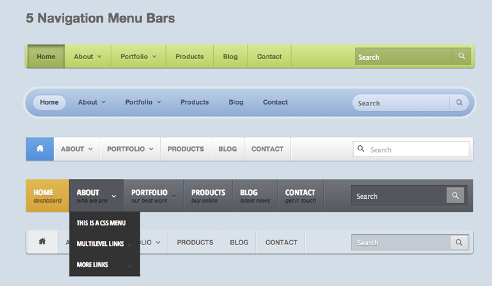
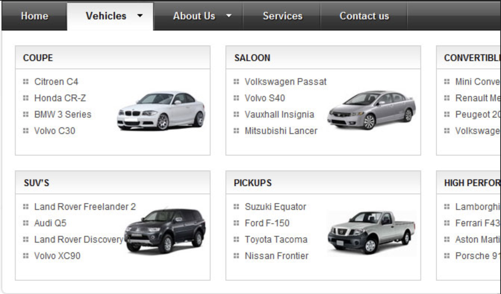

# Warm Up - Horizontal Menus

## Overview

The horizontal menu is a staple of website navigation.  In today's challenge, you'll build a horizontal menu bar that can handle drop-downs with additional menu items or more content

Horizontal menus, with drop-down items.

Horizontal "mega menu", which has drop-downs that may contain rich content

## Challenge

Create a horizontal menu inside of a `<header>`

- Multiple Top-Level Items
- One Item (the last one) should be "flush right"
- One of the top level items must have a drop down that shows sub-items on hover
- One of the top level items must have a drop down that shows content (other html) on hover
- The drop-downs should hide when the mouse is not over them or their top level menu item
