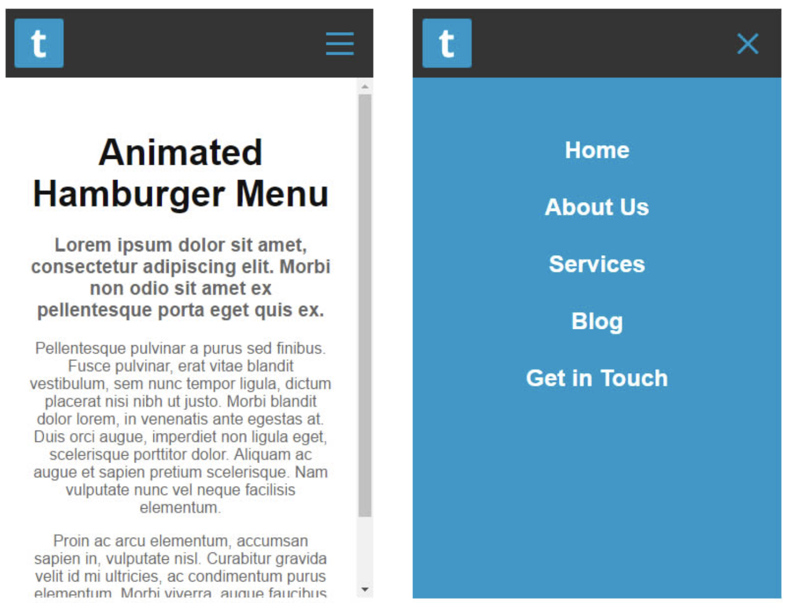

# Warm Up - Hamburger Menus

## Overview

The "hamburger" or slide-out menu is a staple of mobile app and website navigation.  In today's challenge, you'll build a horizontal menu bar that is hidden by default, and "slides-in" when the icon is pressed.

Hamburger Menu Example

## Challenge

Create a horizontal menu inside of a `<header>`

- Top Level Items Only (no sub-menus or mega-content)
- On desktop
  - Show the menu at all times
  - It must be horizontal
  - Hide the hamburger icon
- On mobile
  - Hide the menu altogether
  - Display the "hamburger" icon in it's place
  - When clicked
    - Replace the hamburger icon with a close icon
    - Slide-Out the hidden menu
    - Items should be displayed vertically
