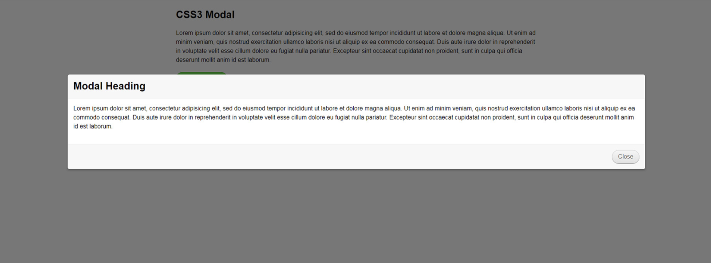

# Warm Up - Modal Dialogue

## Overview

Modals are a UI tool that are often used on websites to gather attention/information as well as to force the user to take one action, restricting access to other content.

Characteristically, modal dialogue boxes:

- Are centered vertically and horizontally
- Sit atop an "overlay" which:
  - Dims out the page content behind the modal
  - Restricts the user from being able to interact with the page below
- Have a close mechanism
  - A button
  - Pressing `<escape>`
  - Clicking "outside" of the box

## Challenge

Implement a Modal dialogue similar to the example.

- Create a button that opens the modal
- Add an overlay to the page, with opacity, restricting the user from selecting text or clicking things
- Set the modal atop the overlay
- Add a close button to the modal which would hide it

## Notes

Accomplish this purely with CSS, no javascript!

### Stretch Goal

- Using Javascript, handle `<escape>` or clicking outside the modal as a means to close the dialogue
