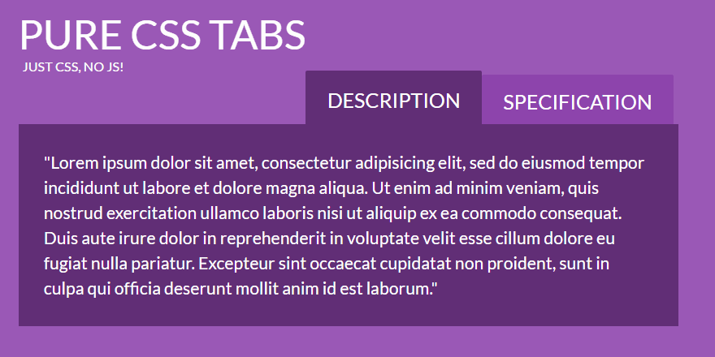

# Warm Up - Revealing Content

Accordions and Tabs are a design pattern that make excellent use of confined spaces, while allowing the user to use a UI that they intuitively understand.

## Overview

Accordions and Tabs are very similar in that they present a list of links (Titles) that, when clicked, will reveal the content associated

Accordion

Tabs

## Challenge

Create both an Accordion and Tab interface, similar to the examples above.

- Use Cards and Decks
- The `.deck` is an element that wraps a list of cards
- Apply classes of `accordion` or `tabs` to the deck to achieve the desired UI
- Each `.card` is the content shown when a given title is clicked

> What is the source of the titles for the accordion/tabs?
> You could try and pull them from the cards, or you could have a separate nav for your deck.
> What are the pros and cons?
