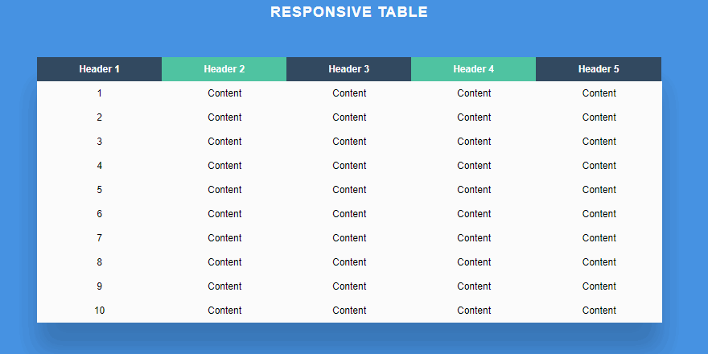

# Warm Up - Tables

Tables are a staple of HTML for showing tabular data. Out of the box, they don't look great, and are impossible to make "responsive"

## Overview

> HTML will always show all of the columns, and compress the content

For this reason, more modern websites are using CSS `grid` and `display:table` to get the look of a table, but also have options as far as being responsive is concerned

## Challenge 1: Table Styling

- Style a standard HTML table with all of the requisite parts to look modern
  - `<table>`
    - `<thead>`
      - `<tr> ... <th>`
    - `<tbody>`
      - `<tr> ... <td>`
    - `<tfoot>`
      - `<tr> ... <td>`

## Challenge 2: Responsive Table

- Keeping your look, based on your style rules above, refactor your `<table />` to be responsive
- The example above is one possible way to make a table look good at smaller resolutions
- Do some looking around for other options, and create an implementation

> Can you make many options/classes for responsive tables and easily switch between them based on a class name?
